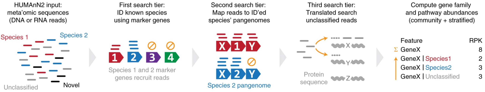
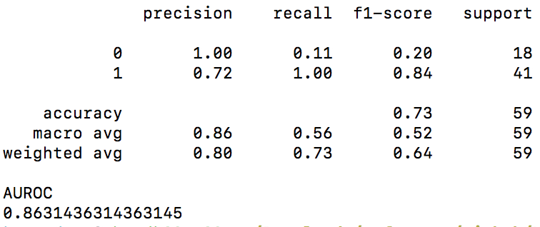
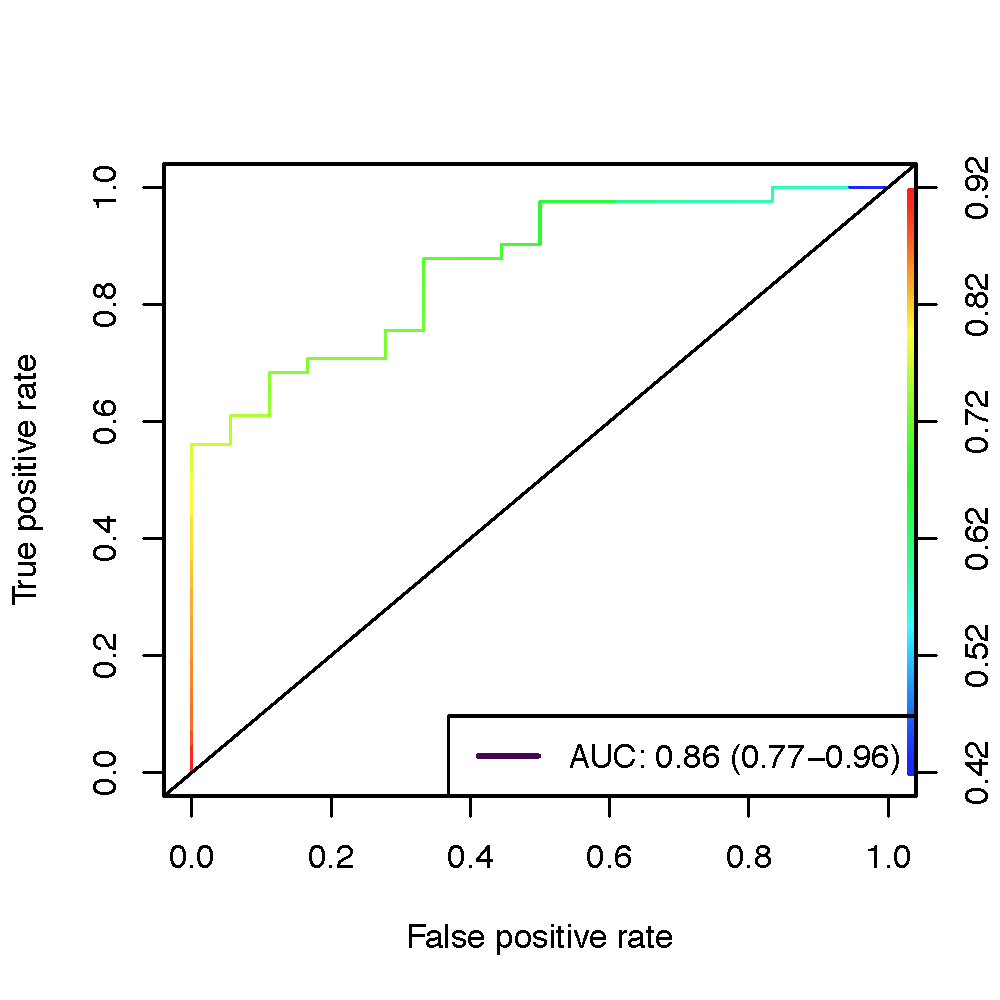

# MetaClaMP-ML
# Metagenome Classification of Metabolic Profiles using Machine Learning
<p align="center">
 
</p>

## AIM
To identify unique metabolic functions in gut metagenomes for disease states such as Colorectal cancer, Diabetic, Obese, Parkinson's disease, and Ulcerative colitis populations.

## WORKFLOW


## PIPELINE
1. Retrieve SRA FASTQ files using NCBI SRA Toolkit (https://trace.ncbi.nlm.nih.gov/Traces/sra/sra.cgi?view=software)
```
for i in `cat SRA.txt`; do fasterq-dump $i --skip-technical --split-3 --min-read-len 50 --outdir $i -e 36; done
```
2. Join reads using Fastq-join (https://github.com/brwnj/fastq-join)
```
for i in `cat SRA.txt`; do fastq-join ${i}/${i}_1.fastq ${i}/${i}_2.fastq -o ${i}/${i}_%.fastq; done
```
3. Quality filter and convert FASTQ to FASTA using PRINSEQ++ (https://github.com/Adrian-Cantu/PRINSEQ-plus-plus)
```
for i in ERR*/*join.fastq; do prinseq++ -fastq $i -min_qual_mean 20 -ns_max_n 0 -derep -trim_qual_right=20 -lc_entropy -min_len 50 -threads 36 -out_format 1 -out_name $i; done
```
4. Rename files and move to one directory
```
mkdir clean_SRA
cp */*.fastq_good_out.fasta clean_SRA/
for i in `cat SRA.txt`; do mv ${i}_join.fastq_good_out.fasta ${i}; done
```

5. From the directory with all your fasta files, run the script [humann2_pre_proc.sh](human2_pre_proc.sh) to create a swarm submit file with:
```
$ bash human2_pre_proc.sh .
```

6. The above command will generate `humann2_submission.swarm`. Submit jobs using this swarm file using the command below. The parameters for memory use and thread-count can be modified appropriately for the cluster being used.
```
$ swarm -f humann2_submission.swarm -g 32 -t 16 --module humann2
```

Your output will be each of the three Humann2 .tsv files in unique directories per input fasta. These are read into the ML algorithm.

## Methods
BioProjects within the Sequence Read Archive were selected for analysis based upon the presence of shotgun sequencing metagenomic samples from the gut microbiome and paired labels identifying the sample with a health status (Supplementary). Disease statuses encompass individuals diagnosed with colorectal cancer, diabetes, obesity, Parkinson’s disease, and ulcerative colitis. Metagenomic gut samples from healthy individuals were also selected. From these studies, 100 representative SRA accessions (Supplementary) were selected for an initial characterization to prototype the following workflow. SRA accessions were downloaded using Fasterq-Dump from [SRA Toolkit](http://www.ncbi.nlm.nih.gov/Traces/sra/sra.cgi?cmd=show&f=software&m=software&s=software) version 2.9.6 , followed by a read quality filter using PRINSEQ++ version 1.2 [1].  All filtered reads contained paired ends, which were concatenated into a single read file using a custom script before being passed as input into HUMAnN2 version 2.8.1 using the UniRef90 full database to optimize the identification of uncharacterized proteins [2].  



Following the HUMAnN2 workflow, output files were normalized based on relative abundance followed by joining all sample tables to create a single table for gene families, path coverage, and path abundance. All three tables were mergedwpathcoverage, genefamilies, preprocessing custom script with R before going into SciKit-Learn

## Results




## Docker

SRAs can be run through our Docker
```
docker pull greenkidneybean/humann2
```

This container will automatically download the Chocophlan (5 GB) and UniRef90 (11 GB) databases.  To run a given SRA accession through the container:

```
docker run humann2 run.py --input sra://<your_SRA#> --ref-db /databases --output-folder <your_out_path>
```

## Environments
[Conda](https://docs.conda.io/en/latest/miniconda.html) environments used throughout our pipeline are provided in the "envs" directory.

## Authors

* **Anna Belford** - *Team Lead*
* **Michael Chambers**
* **Kumardeep Chaudhary**
* **Moamen Elmassry** - *Team Lead*
* **Chirag Jain**
* **Briand Ondov**

## License

This project is licensed under the MIT License - see the [LICENSE.md](LICENSE.md) file for details

## Acknowledgments

<p align="center">
 
</p>
