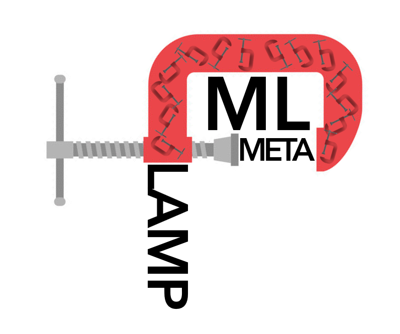
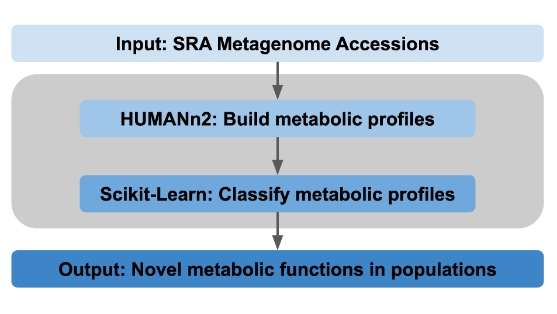

# MetaClaMP-ML
# Metagenome Classification of Metabolic Profiles using Machine Learning
<p align="center">
 
</p>

## AIM
To identify unique metabolic functions in gut metagenomes for disease states such as Colorectal cancer, Diabetic, Obese, Parkinson's disease, and Ulcerative colitis populations.

## WORKFLOW


## PIPELINE
1. Retrieve SRA FASTQ files using NCBI SRA Toolkit (https://trace.ncbi.nlm.nih.gov/Traces/sra/sra.cgi?view=software)
```
for i in `cat SRA.txt`; do fasterq-dump $i --skip-technical --split-3 --min-read-len 50 --outdir $i -e 36; done
```
2. Join reads using Fastq-join (https://github.com/brwnj/fastq-join)
```
for i in `cat SRA.txt`; do fastq-join ${i}/${i}_1.fastq ${i}/${i}_2.fastq -o ${i}/${i}_%.fastq; done
```
3. Quality filter and convert FASTQ to FASTA using PRINSEQ++ (https://github.com/Adrian-Cantu/PRINSEQ-plus-plus)
```
for i in ERR*/*join.fastq; do prinseq++ -fastq $i -min_qual_mean 20 -ns_max_n 0 -derep -trim_qual_right=20 -lc_entropy -min_len 50 -threads 36 -out_format 1 -out_name $i; done
```
4. Rename files and move to one directory
```
mkdir clean_SRA
cp */*.fastq_good_out.fasta clean_SRA/
for i in `cat SRA.txt`; do mv ${i}_join.fastq_good_out.fasta ${i}; done
```

5. From the directory with all your fasta files, run the script [humann2_pre_proc.sh](human2_pre_proc.sh) to create a swarm submit file with:
```
$ bash human2_pre_proc.sh .
```

6. The above command will generate `humann2_submission.swarm`. Submit jobs using this swarm file using the command below. The parameters for memory use and thread-count can be modified appropriately for the cluster being used.
```
$ swarm -f humann2_submission.swarm -g 32 -t 16 --module humann2
```

Your output will be each of the three Humann2 .tsv files in unique directories per input fasta. These are read into the ML algorithm.

## Getting Started

These instructions will get you a copy of the project up and running on your local machine for development and testing purposes. See deployment for notes on how to deploy the project on a live system.

### Prerequisites

What things you need to install the software and how to install them.

```
Give examples
```

### Installing

A step by step series of examples that tell you how to get a development env running

Say what the step will be

```
Give the example
```

## Deployment

Add additional notes about how to deploy this on a live system

## Environments

## Authors

* **Anna Belford** - *Team Lead*
* **Michael Chambers**
* **Kumardeep Chaudhary**
* **Moamen Elmassry** - *Team Lead*
* **Chirag Jain**
* **Briand Ondov**

## License

This project is licensed under the MIT License - see the [LICENSE.md](LICENSE.md) file for details

## Acknowledgments

